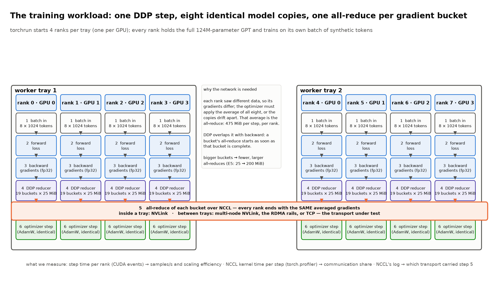

# What a bandwidth curve tells you about your training step

*Two GB300 trays, one all-reduce, three networks, and the arithmetic that connects a message-size
sweep to the speed of a DDP training job.*

I recently did a take-home exercise for fun. The brief was short: build a small, production-minded
distributed PyTorch environment, measure distributed performance, find a bottleneck, make **one**
controlled change, and prove the result. It did not care which scheduler I used. It cared about
reproducibility, observability, systems reasoning, and whether I could separate what I measured from
what I concluded.

I had two NVIDIA GB300 trays to do it on. That turned out to be exactly enough, and the exercise
turned into something I have wanted to write down for a while: how a single plot — all-reduce
bandwidth against message size — predicts what happens to a training step, and how to read the
counters underneath that plot so you know *why*. Everything here is in the repository
([`drkennetz/compass_takehome`](https://github.com/drkennetz/compass_takehome)); every number comes
from a committed `result.json`, and the commands that produced each one are in
[`docs/demo.md`](demo.md).

I am going to be deliberately slow about it. If you already know what an all-reduce is you can skim
the first two sections, but the worked examples there are the ones I lean on later.

---

## 1. The hardware, in one picture

A GB300 compute tray is one node with four GPUs, two Grace CPUs, and four network cards. The four GPUs
are connected to each other over NVLink (eighteen links each, through NVSwitch). Each GPU has one
ConnectX-8 network card next to it; these are the *rails*, and for reasons that will matter later,
each rail is really four physical 200 Gb/s ports bundled into one 800 Gb/s device. Two such trays sit
in the same NVLink domain, which means a GPU in tray 1 can talk to a GPU in tray 2 over NVLink too,
not only over the network cards.

```
  worker tray 1                                     worker tray 2
  ┌───────────────────────────────┐                 ┌───────────────────────────────┐
  │ GPU0  GPU1  GPU2  GPU3        │   NVLink        │ GPU0  GPU1  GPU2  GPU3        │
  │   └────┴──NVLink──┴────┘      │◄═══════════════►│   └────┴──NVLink──┴────┘      │
  │   │     │     │     │         │  (multi-node,   │   │     │     │     │         │
  │ rail0 rail1 rail2 rail3       │   via IMEX)     │ rail0 rail1 rail2 rail3       │
  │  800G  800G  800G  800G       │                 │  800G  800G  800G  800G       │
  └───┬─────┬─────┬─────┬─────────┘                 └───┬─────┬─────┬─────┬─────────┘
      │     │     │     │      RoCE v2 rail fabric      │     │     │     │
      └─────┴─────┴─────┴───────── rail i ↔ rail i ─────┴─────┴─────┴─────┘

  plus a management NIC per tray carrying the Kubernetes pod network (Cilium, geneve tunnel)
```

So there are three ways for the eight GPUs to exchange data:

1. **NVLink**, including multi-node NVLink between the trays (NVIDIA calls this MNNVL; it needs the
   host's IMEX daemon to grant the GPUs access to each other's memory across trays).
2. **RDMA over the rails** — RoCE v2, meaning RDMA carried inside routable UDP/IP packets, with
   GPUDirect so the NIC reads and writes GPU memory without the CPU touching the bytes.
3. **TCP** — ordinary sockets, either over the pod network on the management NIC or, as a control,
   over one rail's IP interface.

The brief said "do not assume networking is the problem". The way to not assume is to run the same
collective over all three and look.

## 2. What an all-reduce is, with a four-rank toy

Everything in distributed data-parallel training comes down to one operation. Each GPU has a buffer
of numbers; after the operation every GPU holds the element-wise **sum** of all the buffers. That is
an all-reduce.

Take four ranks with a four-element vector each:

```
rank 0: [ 1,  2,  3,  4 ]
rank 1: [10, 20, 30, 40 ]
rank 2: [ 5,  5,  5,  5 ]
rank 3: [ 0,  0,  0,  1 ]
                            → after all-reduce, every rank holds [16, 27, 38, 50]
```

The naive way is for every rank to send its whole vector to every other rank: each rank sends
3 × 4 = 12 elements and receives 12. The ring algorithm NCCL uses most of the time is cleverer and,
surprisingly, moves the *same* total per rank but in a pattern that keeps every link busy at once:

**Reduce-scatter (3 steps).** Arrange the ranks in a ring. In step 1 each rank sends one element to its
right neighbour and adds the one it receives from its left neighbour into its own copy. After
n−1 = 3 steps, each rank owns the *complete sum* of exactly one element: rank 0 knows 16, rank 1 knows
27, and so on.

**All-gather (3 steps).** Now each rank passes its finished element around the ring. After another
3 steps everyone has all four sums.

Count what one rank sends: 3 elements in the reduce-scatter, 3 in the all-gather, 6 of 4 elements
total. In general a rank sends

```
    bytes sent per rank = 2 × (n − 1) / n × S
```

where S is the buffer size and n the number of ranks. For n = 4 that is 1.5 S; for our eight GPUs it is
1.75 S. The clever part is that it does not depend on n very much: whether you have 4 or 4,000 ranks,
every rank sends a bit less than 2 S, and every link in the ring carries the same amount
simultaneously. That is why collective benchmarks report **bus bandwidth**:

```
    algorithm bandwidth  (algbw) = S / time
    bus bandwidth        (busbw) = algbw × 2 (n − 1) / n
```

algbw is "how fast did my buffer get reduced"; busbw is "how hard did the links work", and it is the
number you compare against a cable's line rate. A real example from the runs: a 4 GiB per-rank
all-reduce over the four RDMA rails took 17.7 ms. algbw = 4 GiB / 17.7 ms = 243 GB/s; busbw =
243 × 1.75 = 425 GB/s. Over NVLink, 8 GiB took 18.0 ms: algbw 477 GB/s, busbw 835 GB/s.

One more thing the toy makes obvious: the ring has **steps**, and every step is a round trip of
handshakes and kernel launches whose cost does not depend on how many bytes it carries. Keep that in
mind.

## 3. The curve

Here is the measurement the whole post hangs on. Same eight GPUs, same all-reduce, message sizes from
1 MiB to 8 GiB per rank, three transports. (The TCP paths were run at three sizes only; they are slow
enough that I did not want to wait.)


| per-rank size | NVLink | 4 RDMA rails | TCP on one rail | TCP on the pod overlay |
|---|---|---|---|---|
| 1 MiB | 22 GB/s | 20 GB/s | | |
| 16 MiB | 267 | 132 | 73 | 3.7 |
| 128 MiB | 537 | 362 | | |
| 512 MiB | 695 | 412 | 110 | 4.5 |
| 4 GiB | 832 | 425 | 118 | 4.1 |
| 8 GiB | 835 | 385 | | |

Three things to see, in order of importance.

**At 1 MiB the transports are indistinguishable.** 22 versus 20 GB/s. An NVLink fabric that can do
835 GB/s and a RoCE path that can do 425 GB/s deliver the same speed for a megabyte. That is because
at that size the time is not spent moving bytes at all; it is spent in the fixed cost per operation
from the previous section. We measured that floor directly with a second sweep from 4 KiB up:

| per-rank size | NVLink | RDMA |
|---|---|---|
| 4 KiB | 60 µs | 56 µs |
| 64 KiB | 80 µs | 94 µs |
| 1 MiB | 83 µs | 86 µs |

Two hundred and fifty times more data, from 4 KiB to 1 MiB, costs about forty per cent more time. Below
a few megabytes an all-reduce is a fixed ~60–90 µs event, and nothing you do to the wire changes it.

**The curve rises until the wire dominates, then flattens at the wire's speed.** You can model this
with one line: the time for one all-reduce is a latency term plus a bandwidth term,

```
    T(S) = L + S / B
```

and busbw(S) = 1.75 S / T(S). The size at which half of the time is fixed cost and half is bytes is
simply S½ = L × B. Plugging in NVLink's measured floor (L ≈ 80 µs) and its asymptote (B ≈ 477 GB/s
algbw): S½ ≈ 36 MiB. Look at the table: at 32 MiB NVLink is at 362 GB/s, 43 % of its 835 GB/s
ceiling. The one-parameter model lands within a few per cent for NVLink.

For RDMA the same model (L ≈ 85 µs, B ≈ 243 GB/s) predicts S½ ≈ 20 MiB and 263 GB/s at 32 MiB; we
measured 155. So the RDMA path has more per-message cost than one latency term captures, and NCCL also
switches protocols as messages grow. The model is a way to think, not a fit; the measured curve is the
truth. But the shape is right, and the lesson is the same: **below S½ you are paying for operations,
above it you are paying for bytes.** That sentence is the bridge to training.

**The order of the transports is the order of the hardware.** NVLink 835, rails 425, TCP on the same
rail 118, TCP on the overlay 4. The last two are the same cable: RoCE gets 3.6× more out of it than
sockets because the NIC moves the bytes to GPU memory itself, with no CPU copies and no kernel network
stack. The overlay number is the one to remember when someone suggests running the data plane through
the CNI. I did not infer which transport each run used from its speed, by the way: NCCL names the
transport for every channel it builds, and each result file records those lines (256 `P2P/MNNVL`
channels for NVLink, 640 `NET/IB/…/GDRDMA` for RDMA, `NET/Socket` for TCP). A fabric run that silently
fell back to sockets would be a failure, not a slow result.

## 4. From the curve to a training step

Now the part I actually wanted to write.

Distributed data-parallel training is the simplest way to use eight GPUs: every GPU holds the whole
model, every GPU gets a different slice of the batch, every GPU computes gradients on its slice, and
then — because the optimizer must apply the *same* update everywhere or the eight copies drift apart —
the gradients are averaged with an all-reduce before the optimizer step. The model stays identical on
all eight without ever copying weights around, because identical weights plus identical averaged
gradients give identical new weights.



My model was a small GPT: 124 million parameters, kept in fp32 under bf16 autocast, trained on
synthetic tokens (nothing downloaded, every rank sees the same statistics). 124.4 M × 4 bytes =
**475 MiB of gradients per step**, on every GPU, every step. PyTorch's DDP does not wait for the whole
backward pass to finish before reducing; it packs gradients into *buckets* of 25 MiB (the default) in
reverse layer order and launches one all-reduce per bucket as soon as that bucket is full, so the
communication overlaps with the rest of the backward computation. 475 MiB / 25 MiB ≈ **19 all-reduces
of 25 MiB per step**.

Now read 25 MiB off the curve. It sits just below NVLink's S½ and above RDMA's: on NVLink a 25 MiB
all-reduce runs at roughly 360 GB/s busbw, on the rails at roughly 155. The time for one is
1.75 × 25 MiB / busbw:

```
    NVLink:  1.75 × 26.2 MB / 362 GB/s = 0.13 ms   × 19 buckets = 2.4 ms
    RDMA:    1.75 × 26.2 MB / 155 GB/s = 0.30 ms   × 19 buckets = 5.6 ms
```

A single GPU does one training step in 21.0 ms. If none of the communication overlapped with compute,
the curve predicts 23.4 ms on NVLink and 26.6 ms on the rails. Here is what we measured:

| GPUs | placement | step | samples/s | efficiency | NCCL kernel residency per step |
|---|---|---|---|---|---|
| 1 | one tray | 21.0 ms | 381 | 100 % | 0 % |
| 2 | one tray | 22.5 ms | 710 | 93 % | 6 % |
| 4 | one tray | 26.9 ms | 1191 | 78 % | 78 % |
| 8 | two trays, NVLink | 22.8 ms | 2804 | 92 % | 70 % |
| 8 | two trays, RDMA | 30.6 ms | 2090 | 69 % | 91 % |


Efficiency is throughput divided by N times the single-GPU throughput; 100 % would mean eight GPUs do
exactly eight times the work. The NVLink run cost 1.8 ms extra per step against the 2.4 ms the curve
charges for nineteen collectives, which means DDP's overlap hid about a quarter of it. The RDMA run cost
9.6 ms extra against a predicted 5.6, so there the real step was *worse* than the back-to-back
collective sweep: in a training step the all-reduce kernels compete with the backward kernels for the
same streaming multiprocessors, the last buckets (the earliest layers, computed last) cannot overlap
with anything, and the slower the wire the longer that exposed tail. The last column — the fraction of
the step during which an NCCL kernel was resident on the GPU, from `torch.profiler` — makes the same
point: 91 % on the rails. It is an upper bound on exposed communication because those kernels overlap
compute; the efficiency column is the real scaling number.

Two more lines of that table are worth reading carefully, because they are where "do not assume
networking" bites. From 1 to 4 GPUs on *one tray* efficiency falls from 100 to 78 %, and no network
card is involved: that is nineteen collectives' fixed cost landing on a 21 ms step, plus the fact that
the 4-rank intra-tray pattern is less efficient than the 8-rank NVSwitch reduction across both trays.
Eight GPUs over NVLink (92 %) beating four on one tray (78 %) is the same effect from the other side.
The network is not the only thing that can make scaling look bad; the size of the step relative to the
fixed cost per collective does it on its own.

### The knob the curve hands you

If the problem on the rails is nineteen fixed costs, the curve says: issue fewer, larger collectives.
With `bucket_cap_mb=200` instead of 25, the 475 MiB become two full buckets and a partial third, and
200 MiB on the rails sits near the top of the curve at roughly 385 GB/s:

```
    RDMA, 200 MiB buckets:  1.75 × 210 MB / 385 GB/s = 0.95 ms   × 3 buckets = 2.9 ms
```

Measured: the step went from 30.6 ms to **23.1 ms** (+2.1 ms over a single GPU, against the predicted
2.9; overlap hid some), throughput from 2090 to 2769 samples/s (+32 %), and NCCL kernel residency from
91 % to 32 %. One line in the training script, no change to the network, and the rails run recovers
most of the gap to NVLink. The curve predicted it to within a millisecond.

Two things people ask about this change. Does it cost GPU memory? Not meaningfully: DDP's bucket buffers
total the gradient size (475 MiB) however you cut them, and NCCL's own buffers are sized separately. Does
it change the model? No: every gradient is still averaged exactly once per step; the bucket cap only
decides how the averaging is grouped into calls. The real cost is overlap: a bigger first bucket starts
communicating later, and a bigger last bucket has nothing left to hide behind. On NVLink, where nineteen
collectives only cost 1.8 ms, bigger buckets would gain little or lose; on the rails they were the
right trade. The optimum depends on L × B for your transport, which is exactly what the curve measures.

## 5. Where the RDMA ceiling actually is

The NVLink run reached 835 GB/s and the rails reached 425. Why 425? "The network is slow" is the
tempting answer, and the brief told me not to take it. So I took the RDMA path apart.

First the obvious experiment: give each pod one, two or four rails and run the same sweep.


| per-rank size | 1 rail | 2 rails | 4 rails |
|---|---|---|---|
| 512 MiB | 115 GB/s | 210 | 417 |
| 4 GiB | 96 | 207 | 394 |

Linear in the rail count. Each rail brings its own ceiling of roughly 100 GB/s of bus bandwidth; the
rails do not interfere with each other. So far that could still mean "each rail is at line rate".

Then I read the counters. Every rail's RDMA device exposes `port_xmit_data` in sysfs (it counts in
4-byte units; multiplied by four it matched `ethtool`'s `tx_vport_rdma_unicast_bytes` to the byte, which
is how I knew the scale was right). A small watcher pod on each tray sampled it once a second during
sustained 4 GiB all-reduces, and here is the arithmetic that changed my picture of the hardware.

A two-node all-reduce has a lower bound on the bytes that must cross between the nodes: each node
must send half of its reduced data over and receive the other half (the reduce-scatter), then
exchange the finished halves (the all-gather) — S bytes per direction per collective, no matter how
clever the algorithm. In the single-rail run a 4 GiB all-reduce took 85.6 ms, so the wire must have
carried at least 4.29 GB / 85.6 ms = 50 GB/s = **402 Gb/s**. The counter said 411 Gb/s. The two
agree, and that is the point: a rail that sysfs (`ports/1/rate`), `ethtool` and every note I had
described as "200 Gb/s" had just carried twice that. The physical device behind each rail VF has four
ports (`rdma_p0_rail0` … `rdma_p3_rail0`, each 200 Gb/s); the virtual function aggregates them into one
800 Gb/s device, and the per-port tools show one plane.

With the right denominator the picture is this:

| run | per rail on the wire | share of 800 Gb/s |
|---|---|---|
| 1 rail | 411 Gb/s | 51 % |
| 4 rails | ~480 Gb/s each | 60 % |

The rails are **not** at line rate. So what is the ceiling? I went down the list with counters rather
than opinions:

- **Congestion?** RoCE uses DCQCN: switches mark packets with ECN under congestion, receivers send
  CNPs, senders slow down. The CNP, ECN, out-of-sequence, sequence-error and ACK-timeout counters were
  flat at zero per second during every window. Not congestion.
- **PCIe?** `lspci` on the ConnectX-8 and `nvidia-smi` on the GPU both show PCIe Gen6 x16 negotiated,
  about 120 GB/s usable per direction, against about 60 GB/s used per rail. Not PCIe.
- **The GPU?** It is nearly idle during a collective (SM activity low), and the NVLink run moves twice
  the bytes without complaint.

What remains is the *injection* side: one NCCL connection per GPU–NIC pair, each with its own proxy
thread and work-request stream, and a GPUDirect route that on this tray goes GPU → C2C → Grace →
PCIe → NIC (the topology matrix shows `NODE`, not `PXB`, between a GPU and its NIC). I want to be
precise about the status of that sentence: it is a hypothesis with the alternatives measured away, not
a proof. The next experiment is more NCCL channels per NIC and a GPU-to-NIC placement check — not a
network change.

## 6. The one controlled change, and why it went the wrong way

The brief asked for one optimization, presented as baseline → hypothesis → change → measurement →
conclusion, and said a negative result was fine if explained. I got one.

**Baseline.** RDMA path, four rails, GPUDirect on, `NCCL_IB_QPS_PER_CONNECTION=1` — NCCL's default
of one RDMA queue pair (think: one connection) per pair of communicating GPUs. 98 / 413 / 408 GB/s at
16 MiB / 512 MiB / 4 GiB, five repeats each.

**Hypothesis, written before running.** The rails are at 55 %; a single queue pair serialises each
peer flow; several queue pairs with the data striped across them (`NCCL_IB_SPLIT_DATA_ON_QPS=1`)
should fill the link better at large sizes. Expected cost: more out-of-order delivery.

**Change.** That variable only, 1 → 2 → 4, five repeats per cell.

**Measurement.**


| size | 2 QPs vs 1 | 4 QPs vs 1 | p (4 vs 1) |
|---|---|---|---|
| 16 MiB | −4 % | −19 % | < 0.001 |
| 512 MiB | −9 % | −32 % | < 0.001 |
| 4 GiB | −8 % | −29 % | < 0.001 |

Repeat-to-repeat spread within a cell was under 2 %; these are real. And the counter window at four
queue pairs said *why* in a way the bandwidth number alone could not: each rail carried 338 Gb/s instead
of 482, with the reordering and congestion counters still at zero. Nothing was being retransmitted and
nothing was congested; the sender was simply doing less useful work per unit time, because striping
every message across queue pairs shrinks each work request and multiplies completions.

**Conclusion.** The headroom on the wire is real, but this knob cannot reach it on this path. It is a
good knob on large fabrics where one flow cannot fill a link because of how switches spread traffic
across spines; between two trays with one hop per rail there is nothing to spread. Keep the default,
and look at the injection side. I would rather present that than a 3 % win I could not explain.

For completeness, the other knobs, each at 16 MiB / 512 MiB / 4 GiB:

| knob | result |
|---|---|
| GPUDirect off (`NCCL_NET_GDR_LEVEL=0`) | −38 % at 4 GiB; same bytes on the wire, 1.6× the time — the cost of bouncing through host memory |
| `NCCL_BUFFSIZE` 4 → 16 MiB | within noise |
| `NCCL_ALGO=NVLS` vs `Ring` on NVLink | 474 vs 388 GB/s algbw at 4 GiB — the NVSwitch reduction is what keeps the NVLink curve climbing |
| `NCCL_ALGO=Tree` | not valid for this run: NCCL has no tree all-gather, and the topology exchange is one. A finding too. |
| TCP with 4 socket threads × 4 sockets | 7× faster than default TCP, still 14× behind RDMA |
| DDP bucket 25 → 200 MiB | +32 % on the training job (section 4) |

## 7. How it was built, briefly

The brief did not care about the orchestrator, but a few choices made the measurements possible and
are worth a paragraph each. Full detail is in [`docs/cluster-bootstrap.md`](cluster-bootstrap.md) and
[`docs/gid-discovery.md`](gid-discovery.md).

**Kubernetes with DRA, not device plugins.** The trays were leased from a shared Slurm pool and turned
into a k3s cluster. GPUs came through Dynamic Resource Allocation (GA in Kubernetes 1.34): devices are
published with their attributes and a pod writes a claim against a device class. The same mechanism
served the NICs, through the network-DRA driver dranet, which is what made "give this pod 4 GPUs and
2 rails" a one-line change per experiment. With the old device-plugin model you can order a *count* of
GPUs and nothing else.

**IPVLAN children, not NIC passthrough.** Upstream dranet moves the NIC into the pod's network
namespace. On this site a host health check inventories the rails, and a moved rail reads as a broken
node — three racks were drained and rebooted that way in earlier work. I used a fork that gives the pod
an IPVLAN child of the rail instead: the rail and its RDMA device stay on the host, the pod gets a child
interface with its own address, and because the host runs the RDMA subsystem in *shared* namespace mode
the driver only has to inject the device's character devices. No `hostNetwork`, no privileged pods,
and the host's view of its NICs never changes. The shared mode can only be set when no container
network namespace exists, so the bootstrap sets it on the freshly leased tray before k3s starts and
restores it at teardown.

**The GID index is discovered, not assumed.** A RoCE NIC chooses which address to send from by an index
into its GID table. Most recipes hard-code 3. Inside an IPVLAN pod the right index is 7 — the child's
address is appended after the host's entries — and a second pod on the same rail would be 11. So every
RDMA run reads the table (`python -m bench gid`), checks all claimed rails agree, and exports the index
before `torchrun` starts. The wrong index does not fail loudly; it gives you a communicator that
connects and moves zero bytes.

**Everything is a result file.** Each run writes a schema-validated `result.json` with per-rank
timings, NCCL's own transport report, the GID table, the image digest and every `NCCL_*` variable in
force, plus a per-rank CSV and the watcher's counter CSV. The analysis, the charts, the summary and the
slide deck are generated from those files; nothing in this post was typed from memory. CI runs the
unit tests (no GPU needed), checks that the rendered manifests match the experiment matrix, validates
the Terraform, smoke-runs the analysis on fixtures, and publishes the arm64 image to ghcr.io.

## 8. What I would want someone to take away

- **Read the message size off your workload before you tune the network.** 475 MiB of gradients in
  25 MiB buckets is nineteen collectives at a size where fixed cost is a third of each call. That one
  observation explained the scaling table and predicted the bucket-size win to within a millisecond.
- **Bus bandwidth is a property of the size, not the fabric.** Below S½ = L × B every transport looks
  the same; above it they separate by the order of the hardware. Quote a bandwidth number without a
  size and it means nothing.
- **Prove the transport, do not infer it.** NCCL tells you which path each channel took. A run that
  quietly fell back to TCP is a bug, and it will look like a slow fabric if you only watch busbw.
- **Counters before opinions.** The 800 Gb/s rails, the flat congestion counters and the Gen6 PCIe links
  were each one sysfs read away, and each one removed a plausible-sounding story.
- **A negative result with a counter behind it is worth more than a positive one without.** Four queue
  pairs cost 29 % and the counters said exactly where the bytes stopped.
- **Change how often you talk before you change how you talk.** On the slower transport, fewer and
  larger collectives recovered most of the gap for free.

The repository has the manifests, the image, the raw results, the analysis, a 30-minute demo runbook
with the exact command behind every number, and the deck. If you run it on your own pair of nodes I
would genuinely like to see how the curve looks there.
