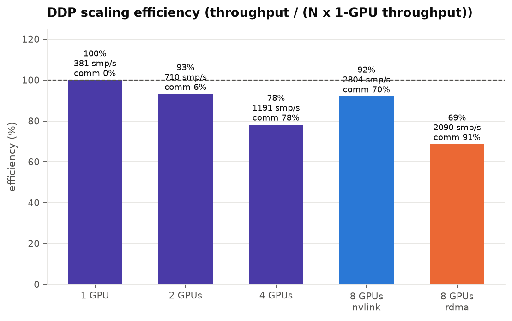
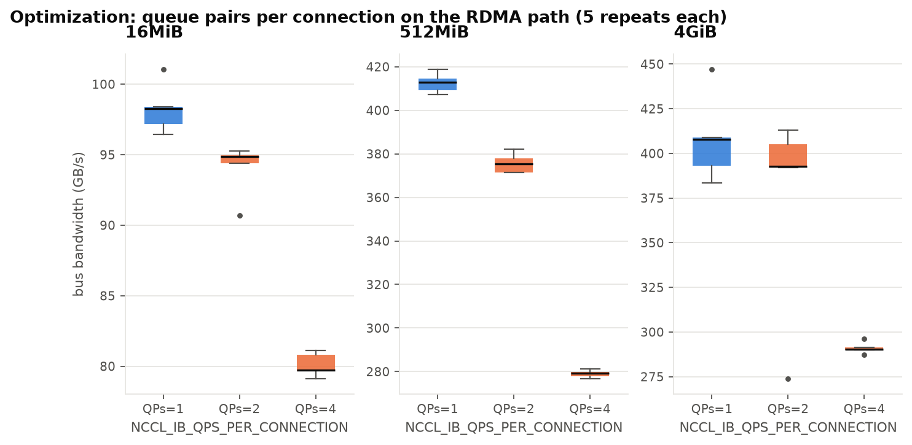

# Results summary

Generated by `python -m analysis` from `results/raw/*/result.json`. Every number below is machine-derived; the raw JSON and per-rank CSVs are the source of truth.

**Runs:** 41 · all validated: True · silent TCP fallbacks on fabric runs: 0

## E1 — all-reduce bus bandwidth (GB/s) by message size and transport

|      bytes | size   |   nvlink |   rdma |   tcp |   tcp-rail |
|-----------:|:-------|---------:|-------:|------:|-----------:|
|    1048576 | 1MiB   |     22.0 |   20.3 | nan   |      nan   |
|    2097152 | 2MiB   |     50.6 |   17.5 | nan   |      nan   |
|    4194304 | 4MiB   |    112.6 |   51.3 | nan   |      nan   |
|    8388608 | 8MiB   |    198.6 |   91.7 | nan   |      nan   |
|   16777216 | 16MiB  |    267.3 |  132.4 |   3.7 |       73.1 |
|   33554432 | 32MiB  |    361.6 |  155.2 | nan   |      nan   |
|   67108864 | 64MiB  |    416.8 |  287.5 | nan   |      nan   |
|  134217728 | 128MiB |    537.3 |  362.2 | nan   |      nan   |
|  268435456 | 256MiB |    647.5 |  405.5 | nan   |      nan   |
|  536870912 | 512MiB |    695.0 |  412.2 |   4.5 |      110.1 |
| 1073741824 | 1GiB   |    718.4 |  245.8 | nan   |      nan   |
| 2147483648 | 2GiB   |    819.8 |  418.1 | nan   |      nan   |
| 4294967296 | 4GiB   |    832.0 |  424.7 |   4.1 |      117.6 |
| 8589934592 | 8GiB   |    835.4 |  385.4 | nan   |      nan   |

## E1 — small-message all-reduce time (µs): the latency floor

|   bytes | size   |   nvlink_us |   rdma_us |
|--------:|:-------|------------:|----------:|
|    4096 | 4KiB   |        59.8 |      56.2 |
|    8192 | 8KiB   |        68.8 |      66.6 |
|   16384 | 16KiB  |        66.2 |      85.0 |
|   32768 | 32KiB  |        73.7 |      82.4 |
|   65536 | 64KiB  |        79.5 |      93.7 |
|  131072 | 128KiB |        91.2 |      85.1 |
|  262144 | 256KiB |        65.3 |     103.2 |
|  524288 | 512KiB |        89.0 |     118.2 |
| 1048576 | 1MiB   |        83.2 |      86.1 |

## E2 — RDMA path: bus bandwidth (GB/s) vs rails claimed per tray

|      bytes | size   |   rails1 |   rails2 |   rails4 |
|-----------:|:-------|---------:|---------:|---------:|
|    1048576 | 1MiB   |    nan   |    nan   |     20.3 |
|    2097152 | 2MiB   |    nan   |    nan   |     17.5 |
|    4194304 | 4MiB   |    nan   |    nan   |     51.3 |
|    8388608 | 8MiB   |    nan   |    nan   |     91.7 |
|   16777216 | 16MiB  |     78.7 |     81.9 |    116.7 |
|   33554432 | 32MiB  |    nan   |    nan   |    155.2 |
|   67108864 | 64MiB  |    nan   |    nan   |    287.5 |
|  134217728 | 128MiB |    nan   |    nan   |    362.2 |
|  268435456 | 256MiB |    nan   |    nan   |    405.5 |
|  536870912 | 512MiB |    115.2 |    209.9 |    416.7 |
| 1073741824 | 1GiB   |    nan   |    nan   |    245.8 |
| 2147483648 | 2GiB   |    nan   |    nan   |    418.1 |
| 4294967296 | 4GiB   |     95.6 |    206.7 |    394.4 |
| 8589934592 | 8GiB   |    nan   |    nan   |    385.4 |

## E3 — DDP workload scaling

| run_id       |   gpus |   nodes | transport   | path     |   samples_per_s |   step_s |   step_p90_s |   comm_fraction |   speedup |   efficiency |   bucket_cap_mb |
|:-------------|-------:|--------:|:------------|:---------|----------------:|---------:|-------------:|----------------:|----------:|-------------:|----------------:|
| e3-g1        |      1 |       1 | nvlink      | local    |           380.7 |      0.0 |          0.0 |             0.0 |       1.0 |          1.0 |              25 |
| e3-g2        |      2 |       1 | nvlink      | unknown  |           709.9 |      0.0 |          0.0 |             0.1 |       1.9 |          0.9 |              25 |
| e3-g4        |      4 |       1 | nvlink      | unknown  |          1191.1 |      0.0 |          0.0 |             0.8 |       3.1 |          0.8 |              25 |
| e3-g8-nvlink |      8 |       2 | nvlink      | nvlink   |          2803.6 |      0.0 |          0.0 |             0.7 |       7.4 |          0.9 |              25 |
| e3-g8-rdma   |      8 |       2 | rdma        | rdma_gdr |          2090.0 |      0.0 |          0.0 |             0.9 |       5.5 |          0.7 |              25 |

## E4 — optimization: NCCL_IB_QPS_PER_CONNECTION (before → after, 5 repeats)

| size   |      bytes |   qps |   n |   busbw_mean |   busbw_std |   busbw_min |   busbw_max |   spread_pct_mean |   delta_pct |   p_value |
|:-------|-----------:|------:|----:|-------------:|------------:|------------:|------------:|------------------:|------------:|----------:|
| 16MiB  |   16777216 |     1 |   5 |         98.3 |         1.7 |        96.5 |       101.0 |               0.4 |         0.0 |     nan   |
| 16MiB  |   16777216 |     2 |   5 |         94.0 |         1.9 |        90.7 |        95.3 |               0.2 |        -4.3 |       0.0 |
| 16MiB  |   16777216 |     4 |   5 |         80.1 |         0.9 |        79.1 |        81.1 |               0.4 |       -18.5 |       0.0 |
| 512MiB |  536870912 |     1 |   5 |        412.6 |         4.5 |       407.3 |       418.8 |               0.3 |         0.0 |     nan   |
| 512MiB |  536870912 |     2 |   5 |        375.7 |         4.6 |       371.3 |       382.3 |               0.3 |        -8.9 |       0.0 |
| 512MiB |  536870912 |     4 |   5 |        279.0 |         1.7 |       276.7 |       281.1 |               0.2 |       -32.4 |       0.0 |
| 4GiB   | 4294967296 |     1 |   5 |        408.0 |        24.3 |       383.3 |       447.0 |               0.1 |         0.0 |     nan   |
| 4GiB   | 4294967296 |     2 |   5 |        375.3 |        57.4 |       273.8 |       412.9 |               0.1 |        -8.0 |       0.3 |
| 4GiB   | 4294967296 |     4 |   5 |        291.0 |         3.2 |       287.3 |       296.0 |               0.0 |       -28.7 |       0.0 |

## E5 — sensitivity appendix (bus bandwidth GB/s)

| run_id                |   16MiB |   512MiB |   4GiB |
|:----------------------|--------:|---------:|-------:|
| e5-algo-nvls          |   296.6 |    695.1 |  829.6 |
| e5-algo-ring          |   326.9 |    634.8 |  679.4 |
| e5-buffsize16m        |   101.3 |    420.0 |  392.7 |
| e5-buffsize4m         |   101.7 |    402.4 |  419.3 |
| e5-counters-gdr-off   |   nan   |    nan   |  253.4 |
| e5-counters-nvlink    |   nan   |    nan   |  832.6 |
| e5-counters-rails1    |   nan   |    nan   |   87.8 |
| e5-counters-rdma      |   nan   |    nan   |  410.4 |
| e5-counters-rdma-qps4 |   nan   |    nan   |  301.5 |
| e5-gdr-off            |   107.0 |    222.4 |  247.5 |
| e5-sock-nthreads4     |    10.3 |     21.6 |   29.4 |

## E5 — DDP bucket size on the RDMA path (communication frequency)

| run_id           |   gpus | transport   |   bucket_cap_mb |   samples_per_s |   comm_fraction |   baseline_samples_per_s |   delta_pct |
|:-----------------|-------:|:------------|----------------:|----------------:|----------------:|-------------------------:|------------:|
| e5-ddp-bucket200 |      8 | rdma        |             200 |          2768.8 |             0.3 |                   2090.0 |        32.5 |

## Counter windows — what the rails, NVLink and PCIe did during a sustained 4 GiB all-reduce

| run_id                | transport   |   rails |   qps | gdr     |   algbw_GBs |   busbw_GBs |   rail_xmit_Gbps_total |   rail_xmit_Gbps_max_per_rail |   rail_rcv_Gbps_total |   xmit_wait_per_s |   out_of_sequence_per_s |   packet_seq_err_per_s |   ack_timeout_per_s |   cnp_sent_per_s |   cnp_handled_per_s |   ecn_marked_per_s |   nvlink_tx_GBps_total |   pcie_tx_GBps_total |   pcie_rx_GBps_total |   sm_active_mean |
|:----------------------|:------------|--------:|------:|:--------|------------:|------------:|-----------------------:|------------------------------:|----------------------:|------------------:|------------------------:|-----------------------:|--------------------:|-----------------:|--------------------:|-------------------:|-----------------------:|---------------------:|---------------------:|-----------------:|
| e5-counters-gdr-off   | rdma        |       4 |     1 | 0       |       144.8 |       253.4 |                 1182.5 |                         295.7 |                1182.4 |               0.0 |                     0.0 |                    0.0 |                 0.0 |              nan |                 nan |                nan |                    0.0 |                  0.0 |                  0.0 |              0.0 |
| e5-counters-nvlink    | nvlink      |       0 |     1 | default |       475.8 |       832.6 |                    0.0 |                           0.0 |                   0.0 |               0.0 |                     0.0 |                    0.0 |                 0.0 |              nan |                 nan |                nan |                  774.3 |                  0.0 |                  0.0 |              0.0 |
| e5-counters-rails1    | rdma        |       1 |     1 | SYS     |        50.2 |        87.8 |                  412.7 |                         412.7 |                 413.7 |               0.0 |                     0.0 |                    0.0 |                 0.0 |              nan |                 nan |                nan |                    0.0 |                  0.0 |                  0.0 |              0.0 |
| e5-counters-rdma-qps4 | rdma        |       4 |     4 | SYS     |       172.3 |       301.5 |                 1356.7 |                         339.2 |                1360.8 |               0.0 |                     0.0 |                    0.0 |                 0.0 |              nan |                 nan |                nan |                    0.0 |                 10.2 |                 12.3 |              0.0 |
| e5-counters-rdma      | rdma        |       4 |     1 | SYS     |       234.5 |       410.4 |                 1837.7 |                         459.6 |                1842.3 |               0.0 |                     0.0 |                    0.0 |                 0.0 |              nan |                 nan |                nan |                    0.0 |                  0.0 |                  0.0 |              0.0 |
