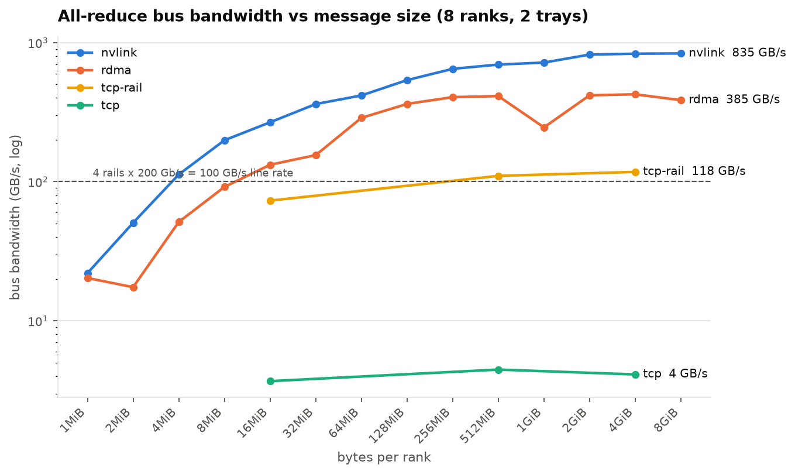
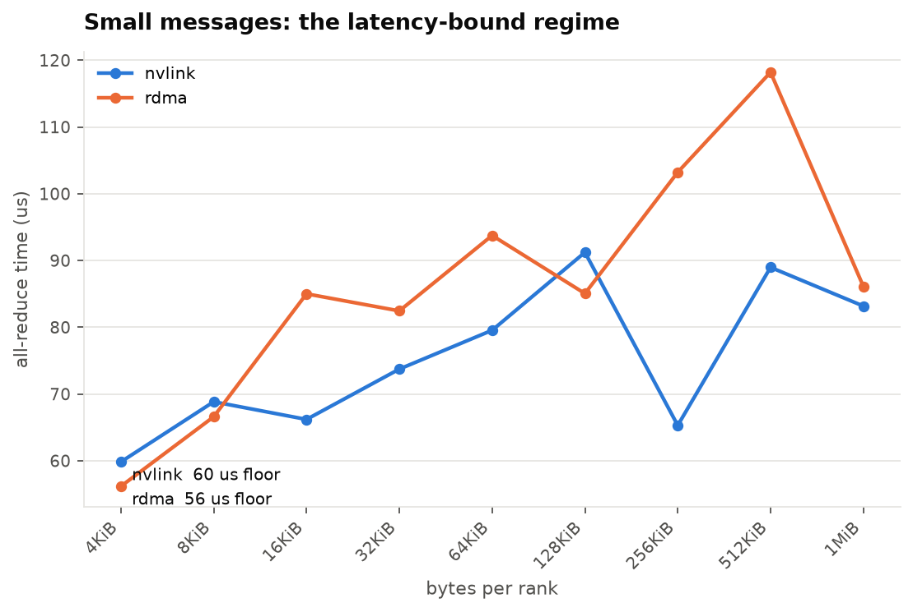
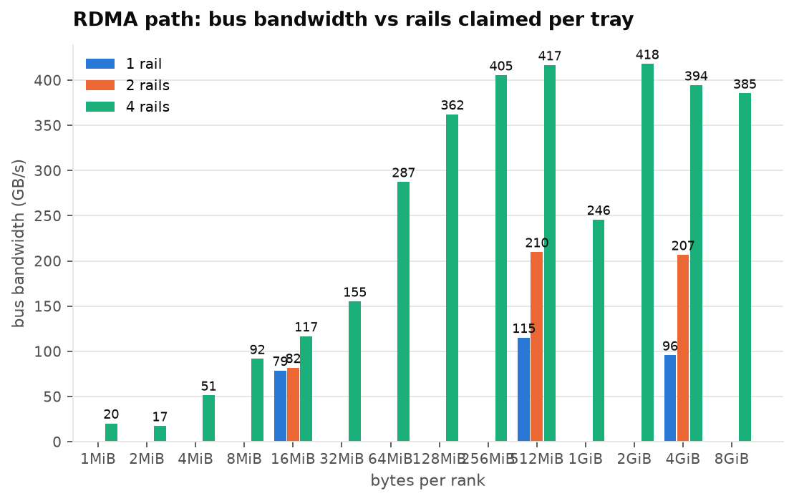

# Results summary

Generated by `python -m analysis` from `results/raw/*/result.json`. Every number below is machine-derived; the raw JSON and per-rank CSVs are the source of truth.

**Runs:** 9 · all validated: True · silent TCP fallbacks on fabric runs: 0

## E1 — all-reduce bus bandwidth (GB/s) by message size and transport

|      bytes | size   |   nvlink |   rdma |   tcp |   tcp-rail |
|-----------:|:-------|---------:|-------:|------:|-----------:|
|    1048576 | 1MiB   |     22.0 |   20.3 | nan   |      nan   |
|    2097152 | 2MiB   |     50.6 |   17.5 | nan   |      nan   |
|    4194304 | 4MiB   |    112.6 |   51.3 | nan   |      nan   |
|    8388608 | 8MiB   |    198.6 |   91.7 | nan   |      nan   |
|   16777216 | 16MiB  |    267.3 |  132.4 |   3.7 |       73.1 |
|   33554432 | 32MiB  |    361.6 |  155.2 | nan   |      nan   |
|   67108864 | 64MiB  |    416.8 |  287.5 | nan   |      nan   |
|  134217728 | 128MiB |    537.3 |  362.2 | nan   |      nan   |
|  268435456 | 256MiB |    647.5 |  405.5 | nan   |      nan   |
|  536870912 | 512MiB |    695.0 |  412.2 |   4.5 |      110.1 |
| 1073741824 | 1GiB   |    718.4 |  245.8 | nan   |      nan   |
| 2147483648 | 2GiB   |    819.8 |  418.1 | nan   |      nan   |
| 4294967296 | 4GiB   |    832.0 |  424.7 |   4.1 |      117.6 |
| 8589934592 | 8GiB   |    835.4 |  385.4 | nan   |      nan   |

## E1 — small-message all-reduce time (µs): the latency floor

|   bytes | size   |   nvlink_us |   rdma_us |
|--------:|:-------|------------:|----------:|
|    4096 | 4KiB   |        59.8 |      56.2 |
|    8192 | 8KiB   |        68.8 |      66.6 |
|   16384 | 16KiB  |        66.2 |      85.0 |
|   32768 | 32KiB  |        73.7 |      82.4 |
|   65536 | 64KiB  |        79.5 |      93.7 |
|  131072 | 128KiB |        91.2 |      85.1 |
|  262144 | 256KiB |        65.3 |     103.2 |
|  524288 | 512KiB |        89.0 |     118.2 |
| 1048576 | 1MiB   |        83.2 |      86.1 |

## E2 — RDMA path: bus bandwidth (GB/s) vs rails claimed per tray

|      bytes | size   |   rails1 |   rails2 |   rails4 |
|-----------:|:-------|---------:|---------:|---------:|
|    1048576 | 1MiB   |    nan   |    nan   |     20.3 |
|    2097152 | 2MiB   |    nan   |    nan   |     17.5 |
|    4194304 | 4MiB   |    nan   |    nan   |     51.3 |
|    8388608 | 8MiB   |    nan   |    nan   |     91.7 |
|   16777216 | 16MiB  |     78.7 |     81.9 |    116.7 |
|   33554432 | 32MiB  |    nan   |    nan   |    155.2 |
|   67108864 | 64MiB  |    nan   |    nan   |    287.5 |
|  134217728 | 128MiB |    nan   |    nan   |    362.2 |
|  268435456 | 256MiB |    nan   |    nan   |    405.5 |
|  536870912 | 512MiB |    115.2 |    209.9 |    416.7 |
| 1073741824 | 1GiB   |    nan   |    nan   |    245.8 |
| 2147483648 | 2GiB   |    nan   |    nan   |    418.1 |
| 4294967296 | 4GiB   |     95.6 |    206.7 |    394.4 |
| 8589934592 | 8GiB   |    nan   |    nan   |    385.4 |

## E3 — DDP workload scaling

_no data yet_

## E4 — optimization: NCCL_IB_QPS_PER_CONNECTION (before → after, 5 repeats)

_no data yet_

## E5 — sensitivity appendix (bus bandwidth GB/s)

_no data yet_
